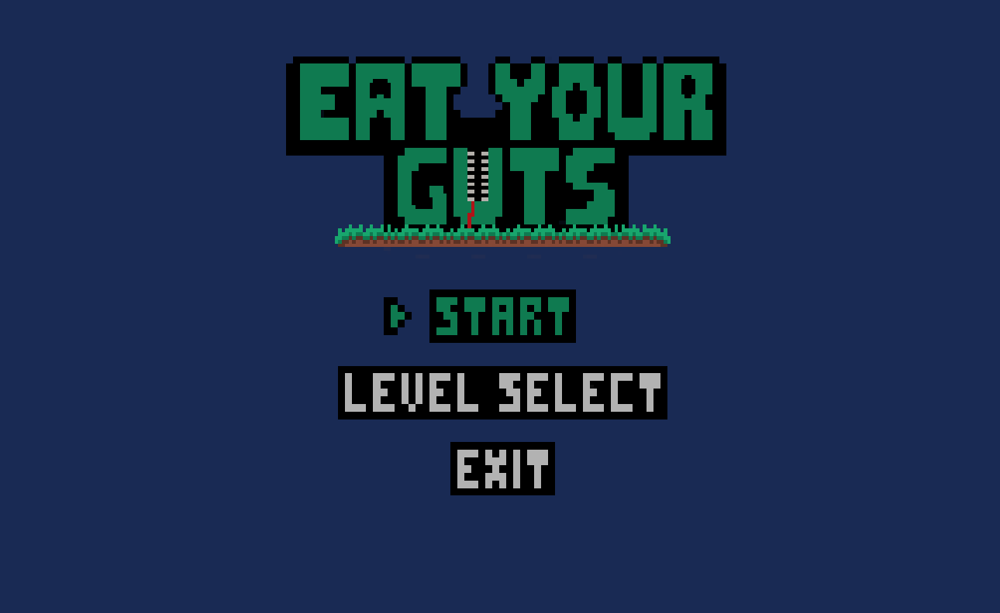
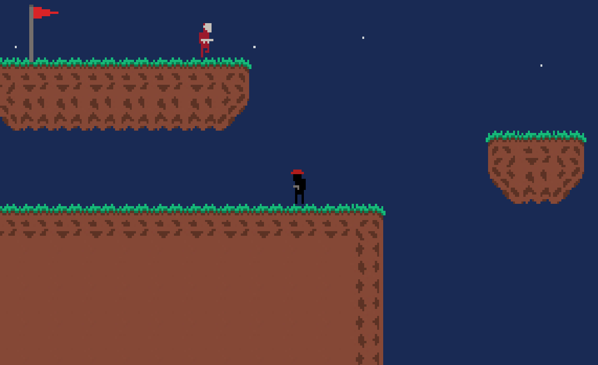
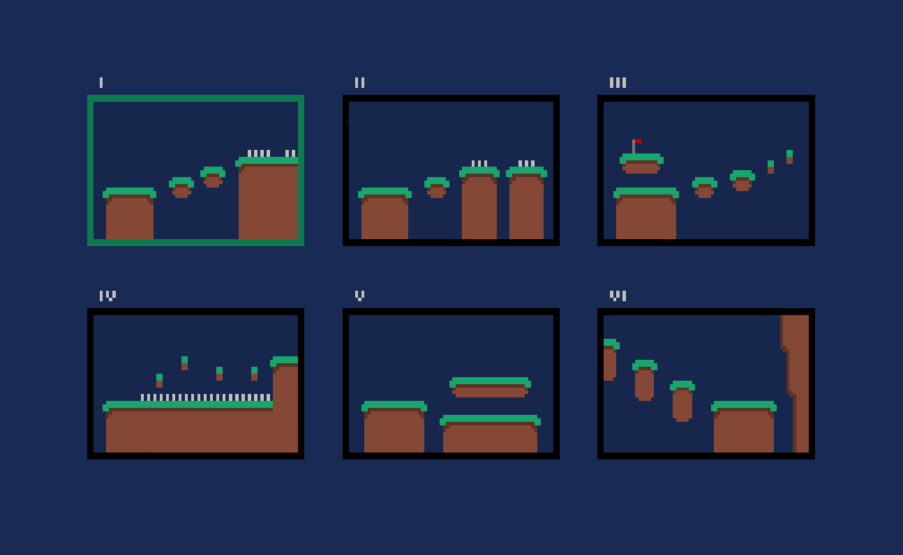

# Eat Your Guts

My third Pygame project!! 

### Overview
A simple platformer with shoot mechanics, enemies, spikes and a main menu with level select.
While creating this game i unknowingly set myself a lot of boundries which limited my development. Nevertheless, I learned a lot and will not make the same mistakes in my next game, but rather I will make new mistakes! :D

### Name Explanation
Up until the very end of this project, it was called "new_project". There were really no distinguishable characteristics that would help me name this game. It a simple and generic platformer But when my friends play-tested it, one of them said that I should name it "Eat your guts" because you want to eat yourself while you play it (Bosnian: "Trebao bi je nazvati "Eat you guts" jer želis da je pojedeš dok je igraš koliko umireš).

